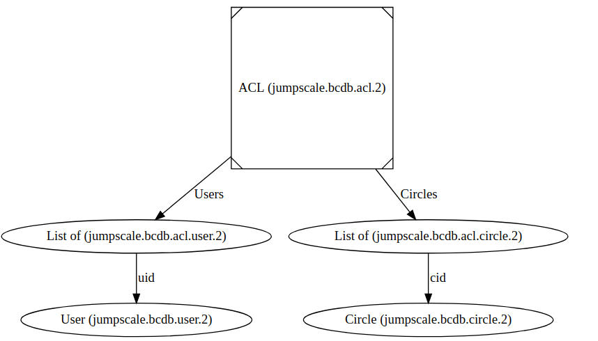

# Access Control List
An access-control list (ACL), with  BCDB, is a list of permissions attached to an object. An ACL specifies which users or circles are granted access to objects

## Users:
schema url : __jumpscale.bcdb.user.2__
  - properties of user:
    - threebot_id
    - email
    - pubkey
    - ipaddr
  - behavior of access:
    - Read (r)
    - Write (w)

## User ACLs:
schema url : __jumpscale.bcdb.acl.user.2__
- name : a name (must be unique)
- uid : id of the user (must be unique)
- rights : the rights (e.g. rw)

## Circle (groups):
schema url : __jumpscale.bcdb.circle.2__
  - properties of user:
    - name
    - description
    - email
    - threebot_id
    - user_members (corresponds to users)
    - circle_members (correspondes to circles)
  - behavior of access:
    - Read
    - Write

## Circle ACLs (groups):
schema url : __jumpscale.bcdb.acl.circle.2__
- name : a name (must be unique)
- cid : id of the circle (must be unique)
- rights : the rights (e.g. rw)



## example 

```python
bcdb = j.data.bcdb.get("test")

#create user
u = bcdb.user.new()
u.name = "kds_1"
u.email = "user1@me.com" 
u.threebot_id = "user1.ibiza"
u.save()

#create circle
g = bcdb.circle.new()
g.name = "circle_1"
g.email = "circle1@me.com"
g.dm_id = "circle1.ibiza"
g.user_members = [1] # you can add all users need
g.save()

# create new model and will add our acl to this model
schema = """
    @url = despiegk.test5.acl
    name = "" 
    an_id = 0
        """

model = bcdb.model_get(schema=schema)
a = model.new()

# that will add right to the circle and all users in the circle
a.acl.rights_set(userids=[], circleids=[1], rights="rw")


assert a.acl.rights_check(1, "r") is True
assert a.acl.rights_check(1, "rw") is True
assert a.acl.rights_check(1, "w") is True


```

## run the test 
``` python 
j.data.bcdb.test(name="acl")
```
