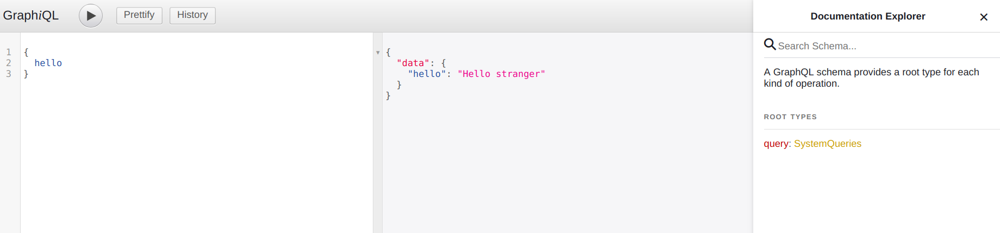
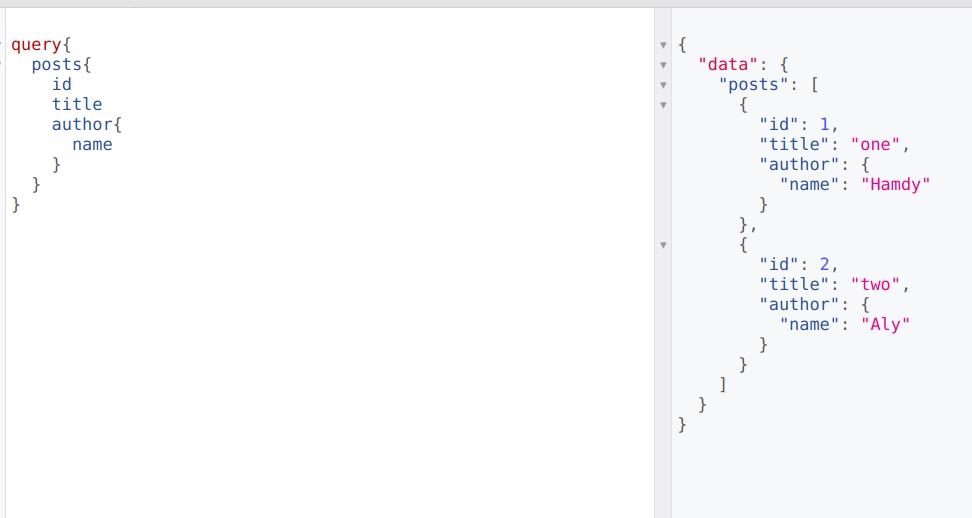
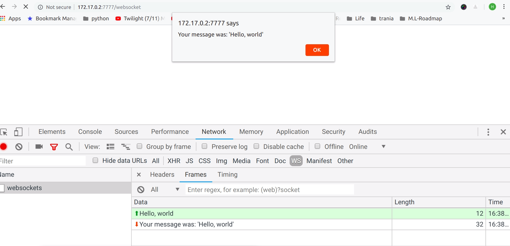
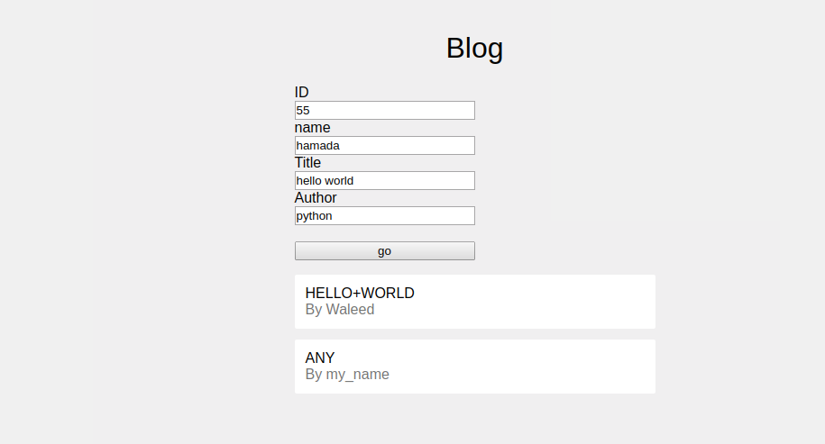
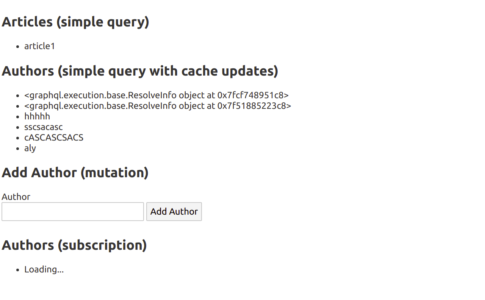
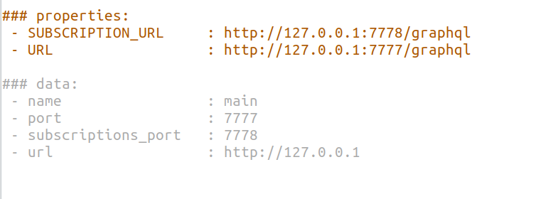
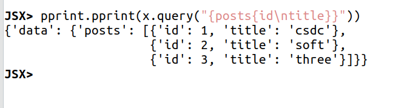

# Graphql server

## run

- use : `j.servers.graphq._server_test_start()`
- graphql server ports
    - `7777` Graphql normal queries & mutations
    - `7778` Graphql subscriptions (websockets)
  


### Test


#### GRAPHIQL

open browser on localhost:7777/graphiql






#### Websockets

A simple test to make sure that websocket port 7778 is open and working

open browser on `http://localhost:7777/websocket`, you should see

   

#### Vuejs Graphql bcdb integration

open browser on `http://localhost:7777/posts`, you should see


All records you are making are saved and retrieved from bcdb



#### Vuejs Graphql subscriptions using websockets

open browser on `http://localhost:7777/counter`, you should see


## Svelete Apollo

```
cd html/svelte-apollo
npm install
npm run dev # build project
```

open browser on `http://localhost:7777/svelte`, you should see





## Python client!

- `client = j.clients.graphql.get()`
- `print(client)`
    
- `client.query("{posts{id\ntitle}}")`
    

    


