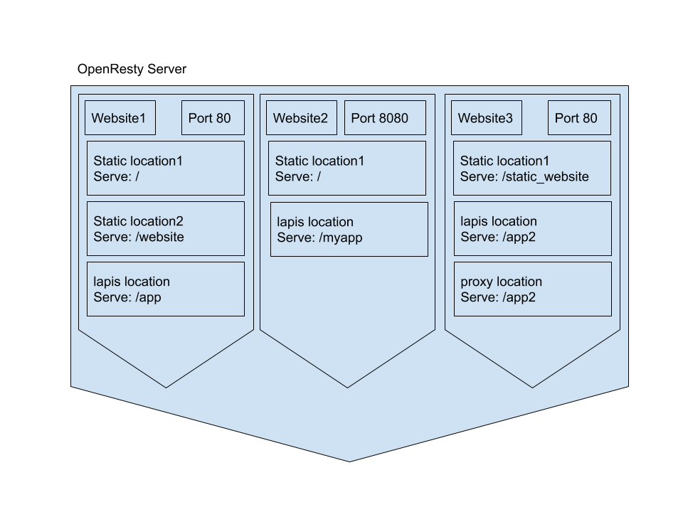

# Openresty Server
Webserver based on [nginx](https://www.nginx.com/) and [lapis](https://leafo.net/lapis/reference/getting_started.html)

## Components
### website:
website is equivalent to vhost in Nginx, it listens on a port and serves some locations

## Locations:
there are three types of locations

to use locations:
```
server = j.servers.openresty.get("example")
server.install(reset=True)
server.configure()
website = server.websites.get("example")
website.ssl = False
locations = website.locations.get("main")
```


### 1- static location:
a location to serve static files  
**params**:  
path_url: the route to this location  
path_location: directory of static files to be served  
index: the index file  

Example:
```
static_location = locations.locations_static.new()
static_location.name = "static"
static_location.path_url = "/static"
static_location.path_location = f"/mylocation/web_resources/static"
static_location.use_jumpscale_weblibs = True
```


### 2- lapis location
path_url: the rout to this location
path_location: path to a directory contains `app.moon` file

Example:
```
lapis_location = locations.locations_lapis.new()
lapis_location.name = "apps"
lapis_location.path_url = "/"
lapis_location.path_location = f"/mylocation/examples/lapis"
```

### 3- proxy location
path_url: the rout to this location
ipaddr_dest: the destination ip address
port_dest: the destination port
schema: (http or https) for the destination server


Example:
```
website = server.websites.get("example")
website.ssl = False
locations = website.locations.get("proxied")
proxy_location = locations.locations_proxy.new()
proxy_location.name = "proxy1"
proxy_location.path_url = "proxy/"
proxy_location.ipaddr_dest = "0.0.0.0"
proxy_location.port_dest = "8080"
proxy_location.scheme = "http"
locations.configure()
website.configure()
```


## How to start 


