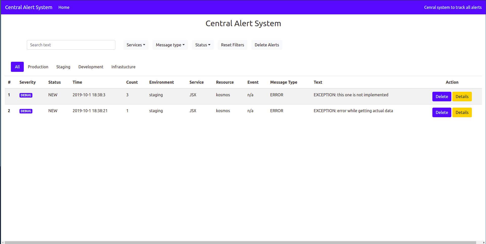
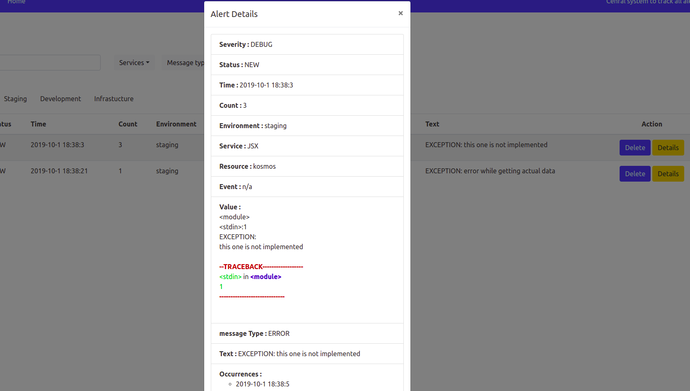

# Alerta

Central monitoring system built using sapper and gedis actors (with jumpscale alert handler integration).




## Running

- install bottle module `pip3 install bottle`
- install frontend dependencies `cd alerta && npm install`
- build frontend `./build_frontend.sh`
- execute `kosmos -p 'j.threebot.package.alerta.start()'`
- server will start at `172.17.0.2/zerobot/alerta`

## The package file

See [package.py](../package.py) where the following is done

- create openresty server on a port
- create a location to serve static files (or a proxy).
- add actors and expose them via gedis http interface


Note that base package do some automatic loading at creation of locations.

## Actors

See [actors](../actors), for example we have alerta actor with the following methods:

- `list_alerts` : list all alerts
- `list_alerts_by_env`: get alerts by environment
- `new_alert`: create new alert in system


```
JSX> anew = j.clients.gedis(...., port=8901)
JSX> anew.actors.alerta.list_alerts()
... a very long list
JSX> anew.actors.alerta.new_alert(
   severity=10,
   status="new",
   environment="ALL",
   service="JSX",
   resource="xmonader",
   event="event 1",
   value="n/a",
   messageType="error",
   text="rafir text")
## actors.default.alerta.new_alert.16c54214bfcd2a5b61f789be085a1d14
res                 : True
```

## Alert handler integration

Alerta can view exceptions raised inside jumpscale, by setting up alert handler tool

```
JSX> j.tools.alerthandler.setup()
```

Then any error raised will be recorded into alerts model, to test, just raise any `j.exceptions.Base` based error

```
JSX> raise j.exceptions.NotImplemented('this one is not implemented', level=10)
```

Then refresh alerta page to see it!
