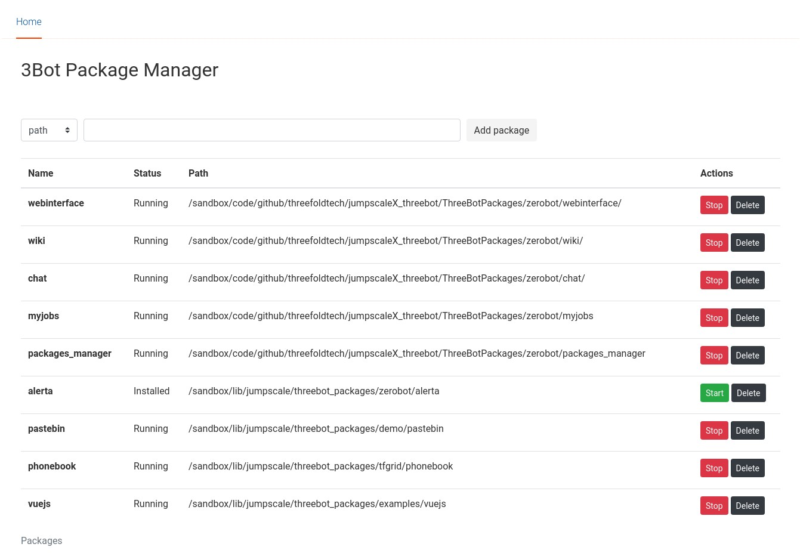

# Packages Manager
a lightweight and easy to use threebot packages manager

Can add packages from specific path or a git repository, and the full life cycle of a package (start, stop, delete..etc)

