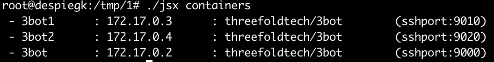

# Getting started: a Docker container with jsx

## Preparation

### Get jsx file
- Get jsx file from github repository on (Ubuntu) machine

    ```bash
    curl https://raw.githubusercontent.com/threefoldtech/jumpscaleX_core/master/install/jsx.py > /tmp/jsx;
    chmod +x /tmp/jsx;
    ```
OR
-  Copy jsx bin to a running (Ubuntu) machine using scp from a machine</br>

    ```bash
    scp /sandbox/bin/jsx root@REMOTE_MACHINE_IP:/tmp/;
    scp /sandbox/code/github/threefoldtech/jumpscaleX_core/install/InstallTools.py  root@REMOTE_MACHINE_IP:/tmp/
    ```


### Login to remote machine

- login to the remote machine, make sure ssh-key is forwarded
- e.g. ```ssh -A root@REMOTE_MACHINE_IP```

### Reset

**this will remove all images & docker containers (BE CAREFUL).**

make sure you have no old images or containers

```bash
jsx containers-reset
```


### Deploy 3bots

```bash
cd /tmp
./jsx threebot-test
#if you want the webcomponents use -w
./jsx threebot-test -w
#if you want to delete your container while installing your threebot
./jsx threebot-test -w -d
#if you want to install multiple threebots talking to each other (count=3)
./jsx threebot-test -w -d -c 2
```

### Work with the 3bots

to see the containers run the following :

`./jsx containers`



to use one of the threebots

```bash
jsx container-shell -n 3bot2
#if you want the kosmos shell
jsx container-kosmos -n 3bot2
```

### To create your own base images

Useful to have an up to date version which will speed up your deployments

```bash
#to build the base images 'threefoldtech/base' & 'threefoldtech/3bot'
#-b means will build the base as well
jsx threebotbuilder -b
```

this will have all the required components in an ubuntu to start from
and a full 3bot environment. Now its very quick to start 3bots.
