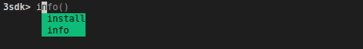
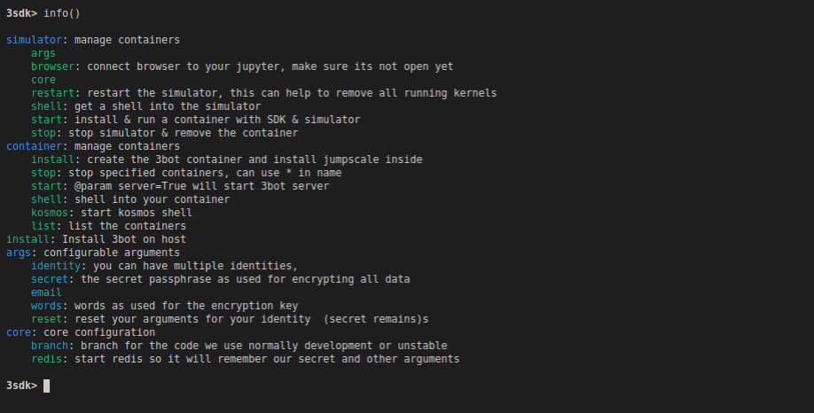

# 3sdk getting started 




### <a name='Gettinghelp'></a>Getting help

You can type `info` and you will see a list of available commands that you can use.



### <a name='BasicFeatures'></a>Basic Features

### Using the 3botconnect app words (mnemonics)

- You have to use same username & same email

#### <a name='StartThreebotContaineronecommand'></a>Start Threebot Container (one command)


> `container threebot`

```
3sdk
Welcome to sdk shell, for help, type info, to exit type exit
3sdk> container threebot                                                                                                                
Which network would you like to register to? 
make your choice (mainnet,testnet,devnet,none): testnet
what is your threebot name (identity)?
example.3bot
Configured email for this identity is me@example.com
Copy the phrase from your 3bot Connect app here.
your words from your 3bot application need to be entered here
specify secret to encrypt your data:
specify secret to encrypt your data (confirm):
```


#### <a name='InstallNewContainer'></a>Install New Container
> `container install name=notsomeuser3 identity=notsomeuser3 email=notsomeuser3@gmail.com server=True`

- server=True means to start 3bot server


#### <a name='RunningNewContainer'></a>Running New Container

to start a new container `container start name=mycontainer`	

#### <a name='ListingContainers'></a>Listing Containers

```
3sdk> container list  
 
list the containers 

  
 - notsomeuser3 : localhost       : threefoldtech/3bot2       (sshport:9000)
 - notsomeuser4 : localhost       : threefoldtech/3bot2       (sshport:9010)
 - 3bot       : localhost       : threefoldtech/3bot2       (sshport:9020)
3sdk>  
```
also using the sshport information you can do `ssh root@localhost -p $SSH_PORT` to manually ssh into the 

#### <a name='AccessingContainerShell'></a>Accessing Container Shell

Either use the sshport info from `container list` command and `ssh root@localhost -p $SSH_PORT` or just execute `container shell` and optionally give it the name of your container

#### <a name='GettingContainerKosmos'></a>Getting Container Kosmos

Execute `container kosmos` to get into kosmos shell


### <a name='Advancedfeatures'></a>Advanced features


##### Controlling code branches

use `core branch` command
