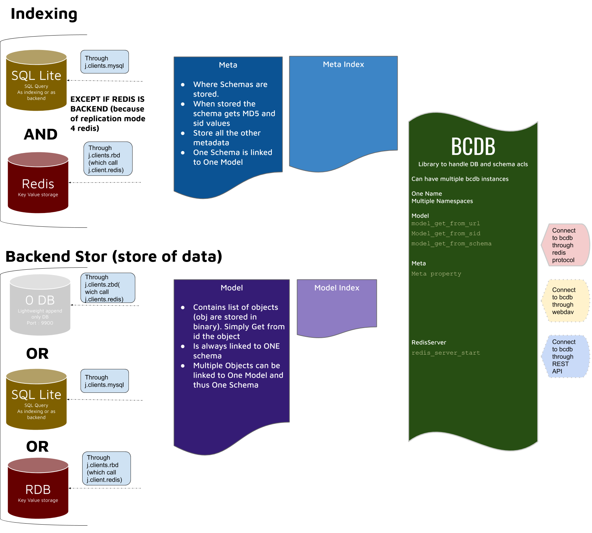

# Block Chain Database (BCDB)
BCDB is a database built with `Block Chain` concepts.

## Components

### Models
The model in BCDB is a class using [JumpScale Schema](/docs/schema/README.md), it adds:
- Indexing capabilities
    - To make data queries go faster, you can use indexing with BCDB for the fields you will query with.
  This can be achieved easily by just adding `*` after the field you want to index in the schema
        ```
        @url = school.student
        name** =  (S)
        subjects = (LS)
        address = !schema.address
        ```
        _if you are not familiar with the [JumpScale Schema](/docs/schema/README.md), it's highly recomended to read
        the schema documentation before proceeding to this part_
        in the previous schema `name` will be indexing, we will demonstrate how to use that to do a query in the usage
        section
- Hooks
    - you can add hooks to be manipulated before set/get

### Namespaces
To organize the models stored in the database, the database is divided into namespaces, the default namespace is called
`default`

### Backend
In order to get BCDB to work, you should provide a Backend client. A `Backend Client` is a `Jumpscale client`
for a key value store (ZDB, Redis or sql) which will be used to save the data

## Usage
```python
# Define the Schema
schema = """
        @url = school.student
        name** =  (S)
        subjects = (LS)
        address = (S)
        """
# Get DB client (we will use zdb test server to start and get zdb client)
db_cl = j.clients.zdb.testdb_server_start_client_get(reset=True)

# Get BCDB databse object
db = j.data.bcdb.get(db_cl,namespace="test",reset=True)

# Create a BCDB model with the previous schema
model = db.model_create(schema=schema)

# Create a new object from the model
o = model.new()

# Fill data
o.name = "foo"
o.subjects.append("math")
o.subjects.append("science")
o.address = "2 bar street"

# Save object to database
saved_object = model.set(o)

# Now you can get Object with ID
loaded_object = model.get(saved_object.id)

# To query using the indexed fields
qres = model.index.select(model.index.name == "foo")

# IMPORTANT NOTE :
# the query result will contain only the id and the indexed fields
# if you want to get the full model you need to get it fom the model using the ID
queried_object = model.get(qres[0].id)
```
## add models from path

```
# Get DB client (we will use zdb test server to start and get zdb client)
db_cl = j.clients.zdb.testdb_server_start_client_get(reset=True)

# Get BCDB databse object
bcdb = j.data.bcdb.get(db_cl,namespace="test",reset=True)

#by default add models and load it to search stored information using the index defined in the schema
bcdb.models_add("/sandbox/code/github/threefoldtech/digitalmeX/packages/notary/models")


```

##  Add trigger
There are a lot of use cases for triggers, In these docs we will use it to create a custom index.

### Creating custom indexing example
Let us assume we have a reservation object which has ```containers``` field which is a list of container objects.
The container object has a single integer field ```node_id``` to refer to the node id which hosts the container.

Our goal is to get all the reservations which has containers hosted on a specific node

```python
bcdb = j.data.bcdb.get(name="reservations")

# defaine reservation schema
reservation_schema = """
@url = jumpscale.reservation.1
containers = (LO) !jumpscale.container.1
"""

# defaine container schema
container_schema = """
@url = jumpscale.container.1
node_id = (I)
"""

container = bcdb.model_get(container_schema)
reservation = bcdb.model_get(reservation_schema)

# define our new index table
class IndexTable(j.clients.peewee.Model):
  class Meta:
    database = None

  pw = j.clients.peewee
  id = pw.PrimaryKeyField(unique=True)
  reservation_id = pw.IntegerField(index=True)
  node_id = pw.IntegerField(index=True)

# define the trigger function
def trigger_func(model, obj, action, **kwargs):
    # Create new record in the index table after storing in BCDB
    if action == 'set_post':
        for container in obj.containers:

            record = model.IndexTable.create(reservation_id=obj.id, node_id=container.node_id)
            record.save()

IndexTable._meta.database = reservation.bcdb.sqlite_index_client
IndexTable.create_table(safe=True)
reservation.IndexTable = IndexTable
# register the trigger function
reservation.trigger_add(trigger_func)
```

Now we can search for the reservations by the container's ```node_id ``` using our index table

```python
c = container.new()
c.node_id = 1

r = reservation.new()
r.containers.append(c)
r.save()

result = reservation.IndexTable.select().where((reservation.IndexTable.node_id == 1)).execute()
assert len(result) == 1
```

### Export/Import

BCDB exposes an export/import functionality.

When exporting, the data is by default encrypted using your key.

```python
bcdb.export("/tmp/bcdbinstnace/)
```

```bash
tree /tmp/bcdbinstnace/node.1/
├── 23.data
├── 24.data
├── 25.data
├── 26.data
├── 27.data
├── 28.data
├── 29.data
├── 30.data
└── _schema.toml
```
for each model, we export the schema, and all the objects. If you send `encryption=False`, each object will be exported as a toml file.

To import the data back, simply call the `import_` function. This will first reset bcdb, then import all the data. Before reseting the data, it will confirm with the user. To disable this, send `interactive=False`.

```python
bcdb.import_("/tmp/bcdbinstnace/")
```

The import loads all the models first and updates the metadata, then starts importing the objects. If you're using zdb as your backend, the success of the export depends on having the same flow before the import, due you to the autoincrement of the internal id of zdb on any key update.
