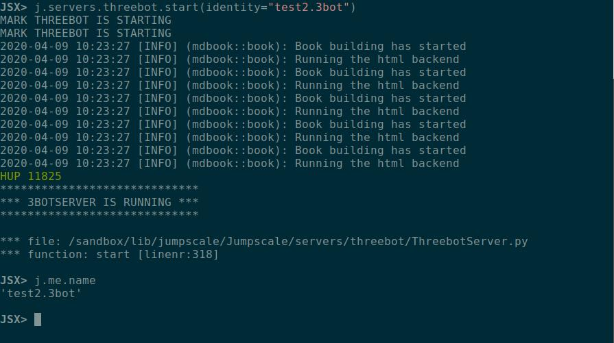

# Initialize 3bot environment with identity

## For the first start of jsx container

- Start kosmos shell using `jsx kosmos -n <YOUR-THREEBOT-NAME>`

Example: `jsx kosmos -n hamada.3bot`

- After kosmos starts make configure to j.me
    ```python
    j.me.configure()
    ```

This will as you about your information, 3botname, email, description .. and if you want to add admins to your system

- Then register to the tf_phonebook using
    ```python
    j.me.tfgrid_phonebook_register()
    ```

 

#### Congratulations your 3bot is ready now you can start the 3bot server and start your reservation.

## To save your identity you can copy these files to safe place

These contains the identity information, please keep them safe

 
 
 
## Creating multiple identities:
You can either start kosmos with a new identity name ```jsx kosmos -n newname.3bot``` which will guide you through configuration, or you can do it from kosmos shell as follows:
```bash
JSX> j.myidentities.get("test2.3bot")
 - save identity:test1.3bot

## jumpscale.threebot.me
ID: 3
 - name                : test2.3bot
 - tid                 : 0
 - tname               :
 - email               :
 - signing_key         :
 - verify_key          :
 - admins              : []
 - sshkey_name         :
 - sshkey_pub          :
 - sshkey_priv         :


JSX> i = j.myidentities.get("test2.3bot")
```
- Then configure your new identity
```
JSX> i.configure()                                                                                                                                                                    
                                                                                                                                                                                        
THREEBOT IDENTITY NOT PROVIDED YET, WILL ASK SOME QUESTIONS NOW                                                                                                                         
                                                                                                                                                                                        
                                                                                                                                                                                        
please provide your threebot connect name (min 5 chars) [test2.3bot]:                                                                                                                   
please provide your email: test2@mail.com                                                                                                                                               
                                                                                                                                                                                        
 *** WILL NOW CONFIGURE SSH KEY FOR USE IN 3BOT ***                                                                                                                                     
                                                                                                                                                                                        
                                                                                                                                                                                        
SSH: found preconfigured SSH key, ok to use ssh key: id_rsa [y/n]: y                                                                                                                    
                                                                                                                                                                                        
 *** WILL NOW CONFIGURE YOUR PRIVATE 3BOT SECURE KEY (IMPORTANT) ***                                                                                                                    
                                                                                                                                                                                        
                                                                                                                                                                                        
Ok to generate private key (Y or 1 for yes, otherwise provide words)?                                                                                                                   
make your choice (y,n): y                                                                                                                                                               
We have generated a private key for you.                                                                                                                                                
The private key:                                                                                                                                                                        
                                                                                                                                                                                        
fine bitter abandon annual inject among vanish supply custom pause beach type puppy exhibit carbon neutral hole trouble drastic remain artwork antique laptop material                  
ITS IMPORTANT TO STORE THIS KEY IN A SAFE PLACE                                                                                                                                         
Did you write the words down and store them in safe place?                                                                                                                              
make your choice (y,n): y                                                                                                                                                               
                                                                                                                                                                                        
give the 3e word of the private key string: abandon                                                                                                                                     
                                                                                                                                                                                        
want to add threebot administrators? [y/n]: n                                                                                                                                           
 - save identity:test1.3bot                                                                                                                                                             
 - save identity:test2.3bot                                                                                                                                                             
JSX> 
```
- Then register to the tf_phonebook using
```python
j.me.tfgrid_phonebook_register()
```

- Then start 3bot server with your preferred identity using
```python
JSX> j.servers.threebot.start(background=True, identity="test2.3bot")
```

- You will find your identity set in 3bot server

