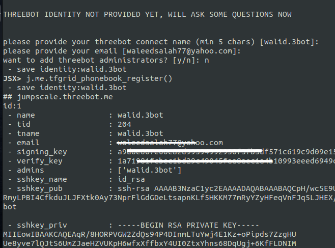
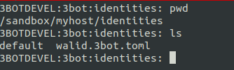

# Initialize 3bot environment with identity

## For the first start of jsx container

- Start kosmos shell using `jsx kosmos -n <YOUR-THREEBOT-NAME>`

Example: `jsx kosmos -n hamada.3bot`

- After kosmos starts make configure to j.me
    ```python
    j.me.configure()
    ```

This will as you about your information, 3botname, email, description .. and if you want to add admins to your system

- Then register to the tf_phonebook using
    ```python
    j.me.tfgrid_phonebook_register()
    ```

 

- Congratulations your 3bot is ready now you can start the 3bot server and start your reservation.

- To save your identity you can copy these files to safe place

 
