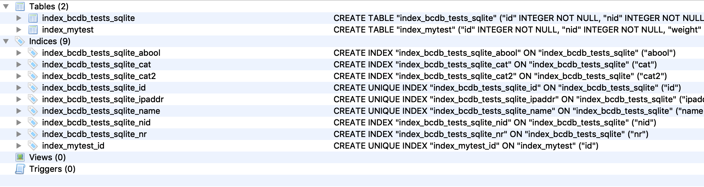
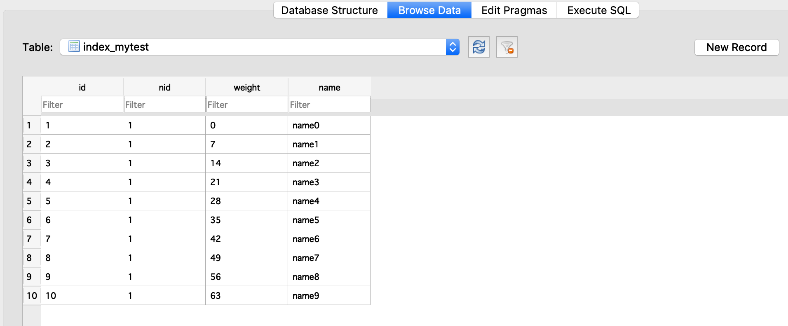

# data management on a class

## principles

Change the properties directly on the object

e.g.

```python
mysshclient = j.clients.ssh.get()
mysshclient.addr = ...

```

## data_update method

- can be used to update data from dict or **kwargs.
- Will update the underlying object.
- Will not save.
- Will trigger self._data_update()

## triggers

see [triggers.md]

see also /sandbox/code/github/threefoldtech/jumpscaleX_core/JumpscaleCore/data/bcdb/tests/17_sqlite.py
this shows how to use a custom peewee class to build an additional index

### examples of the sqlite tables created




