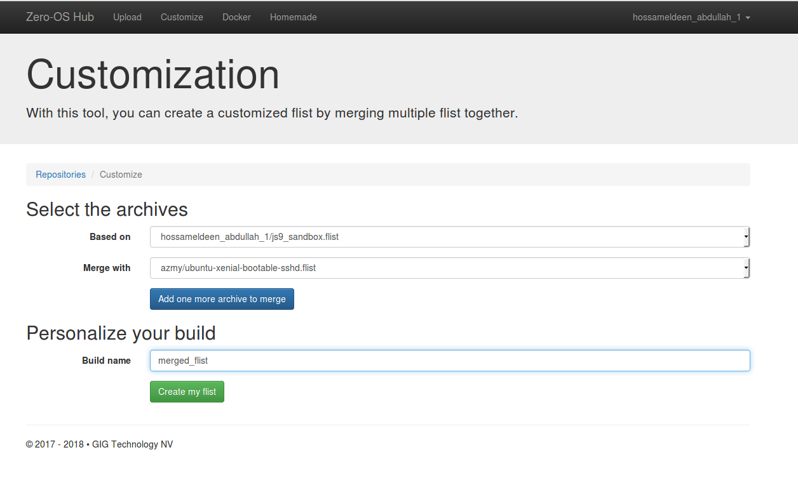

# sandbox python/jumpscale 9.3

requirements

- osx or ubuntu machine with jumpscale installed
- zero_os machine

## how

You can create the sandbox flist if you don't have the link to itby executing the script in this url
https://docs.grid.tf/despiegk/itenv_test/src/branch/master/jumpscale_sandbox_flist.py
it will ask for your itsyouonline and will upload the flist to a directory with your name like
https://hub.grid.tf/hossameldeen_abdullah_1

You can merge it from the following url https://hub.grid.tf/merge

choose "based on" as your generated flist

choose "merge with" as the ubuntu image you will merge with


now you will have the merged flist under your directory
https://hub.grid.tf/hossameldeen_abdullah_1

On the machine with jumpscale, we need to have a connection to te zero_os machine

```bash
zos_cl = j.clients.zero_os.get('node1', data={'host': '<ip_addr>'})
node = j.clients.zero_os.sal.get_node(instance="node1")
```

then create a container on that machine

```bash
container = node.containers.create(name='js_sandbox',
                    flist="<flist-url>",
                    hostname='js', nics=[{"type": "default"}], ports={2200: 22})
```

you can now use jumpscale functionality

```bash
container.client.bash('. /env.sh; js_shell "print(\'works\')"').get()
```
