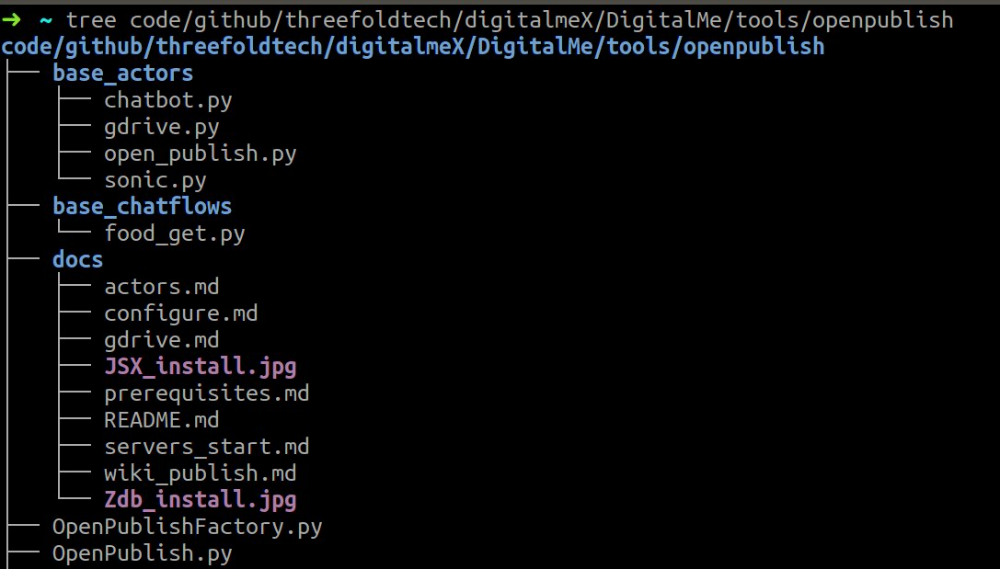

###  Adding new actors/chatflows

To be able to load your new actors/chatflows into open publish, you will need to have them locally.

To Load actors or chatflows from file system:
Before starting open publish tool you can copy/link your actors or chatflows into `base_actors` and `base_chatflows`
in `openpublish` tool directory `/sandbox/code/github/threefoldtech/digitalmeX/DigitalMe/tools/openpublish`




Note that you can easily use bcdb from your actors using:
```python
j.servers.threebot.bcdb_get(NAME, use_zdb=True)
```

where:
NAME: is the bcdb name you need to create/get
use_bcdb: the default is False which will use sqlite as backend, if True will use zdb

