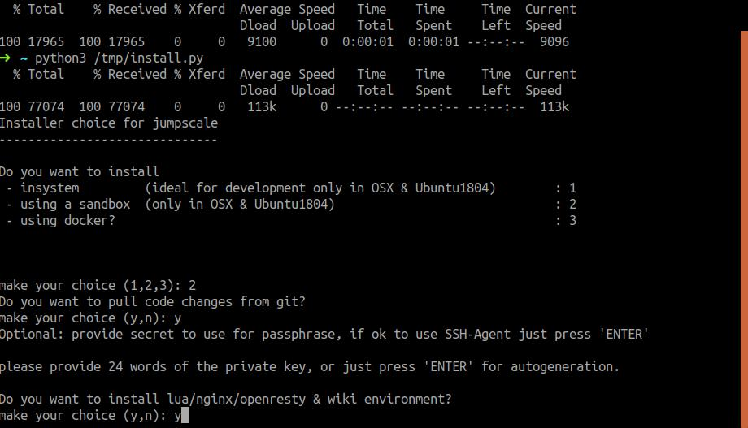
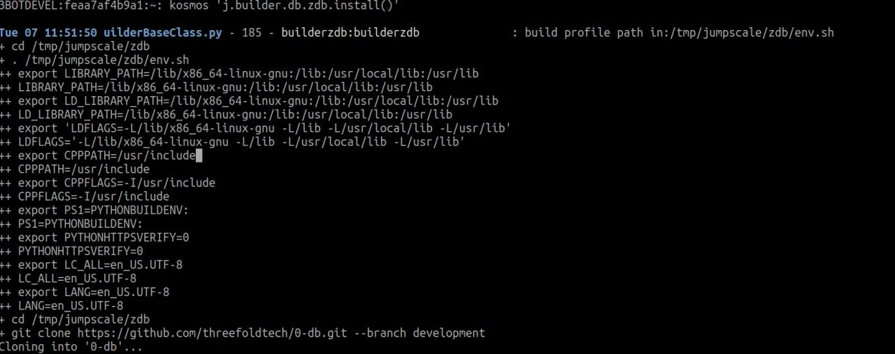

### Prerequisites

To be able to use open publish tool you need to have:
1 - [JumpscaleX](https://github.com/threefoldtech/jumpscaleX/blob/development/docs/Installation/install.md) 
installed with openresty option.

2 - [0-DB](https://github.com/threefoldtech/0-db). Note that you can install it using jumpscaleX builders
by running `kosmos 'j.builders.db.zdb.install()'`. It will clone 0-db repo, build binary and put it into your sandbox bin dir.

