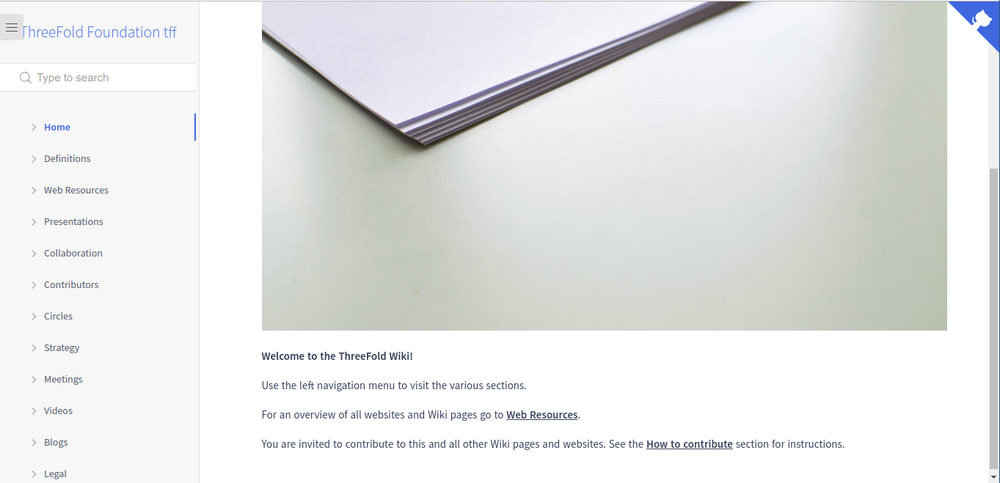

# Wikis

Wikis are a collection of docsites, which are a collection of markdown documents, images and files.

We use [docsify.js](https://docsify.js.org/) to get an html web page directly from markdown, we also use our own [tool](https://github.com/threefoldtech/jumpscaleX/tree/development/docs/tools/wiki) to pre-process this docsites to support some markdown extenstions like [macros](macro/README.md), we also use [lapis-wiki](https://github.com/threefoldfoundation/lapis-wiki) to server this websites.

Some wikis can be found at [threefoldfoundation](https://github.com/threefoldfoundation) organization on github like:
* [Foundation](https://github.com/threefoldfoundation/info_foundation)
* [Tokens](https://github.com/threefoldfoundation/info_tokens)

All wikis are now hosted at [https://wiki.grid.tf/](https://wiki.grid.tf/), for example foundation wiki can be found at [https://wiki.grid.tf/wiki/foundation](https://wiki.grid.tf/wiki/foundation).

Editing the content of this wikis are done collaboratively at the previous repositories, as mentioned earlier, you can use our custom markdown extensions like:

* [Macros](macro/README.md)
* [Custom link format](links.md)

## Running your own wiki
To run your own wiki, more technical documentation can be found [here](https://github.com/threefoldtech/jumpscaleX/tree/development/docs/tools/wiki).
